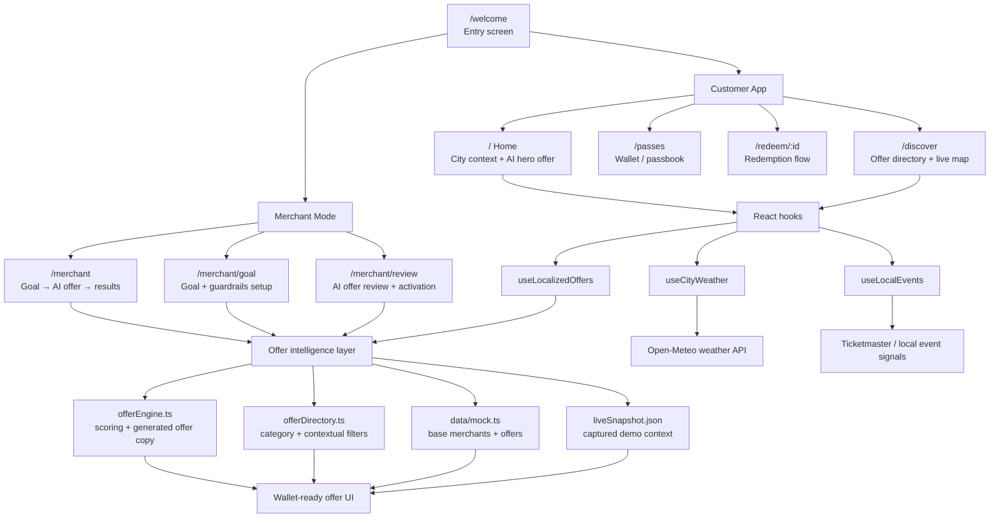

# CityPulse Wallet

CityPulse Wallet is an AI-powered city wallet that turns real-time city signals into personalized, wallet-ready local offers.

Built for the DSV-Gruppe **Generative City-Wallet** hackathon challenge, the project demonstrates how a city wallet can serve both residents and local merchants: users receive relevant offers at the right moment, while merchants set simple business goals and let AI generate safe, localized promotions.

## Demo Entry

Start from:

```txt
/welcome
```

From the welcome screen, you can enter:

- **Customer app**: discover nearby offers, save passes, redeem offers, and explore live city context.
- **Merchant mode**: set a business goal, adjust guardrails, review an AI-generated offer, and track lightweight results.

## Product Concept

CityPulse Wallet detects live city context such as:

- Weather changes
- Nearby activity and demand
- Location and distance
- Time-sensitive windows
- Local merchant goals

It then converts those signals into one best next action for the user: a relevant local offer that is ready to redeem through the wallet.

## Key Features

### Customer Mode

- Premium mobile wallet-style home screen
- AI-matched hero offer based on live city signals
- Discover page with real map experience
- Category filters for local offers
- Passes page for active, upcoming, and used passes
- Offer detail and redeem flows

### Merchant Mode

- Merchant dashboard for a simple business goal
- Goal setup with selectable chips, time window, discount, and radius controls
- AI offer review with reasoning and guardrail checks
- Merchant profile mode
- Separate merchant bottom navigation: Home, Goal, Offer, Profile

### Live Context and AI Simulation

The app combines live/demo context data with a simulated AI offer engine. It uses structured offer data, weather/context hooks, and local signal scoring to recommend offers in a believable way for a hackathon demo.

## Tech Stack

- React
- TypeScript
- Vite
- Tailwind CSS
- shadcn/ui-style components
- React Router
- TanStack Query
- Lucide icons

## Getting Started

Install dependencies:

```bash
npm install
```

Run locally:

```bash
npm run dev
```

Open the app:

```txt
http://localhost:8080/welcome
```

If Vite starts on another port, use the URL shown in the terminal.

## Useful Routes

```txt
/welcome          App entry screen
/                 Customer home
/discover         Discover offers and map
/passes           Wallet/passbook
/profile          Customer profile
/merchant         Merchant home
/merchant/goal    Merchant goal setup
/merchant/review  AI offer review
/merchant/profile Merchant profile
```

## Environment Variables

For optional event enrichment, create a local `.env.local` file:

```bash
VITE_TICKETMASTER_API_KEY=your_ticketmaster_api_key
```

The app still runs without this key by using demo/fallback data.

## Build

```bash
npm run build
```

Preview production build:

```bash
npm run preview
```

## Project Structure

```txt
CityPulse Wallet
├── /welcome
│   └── App entry screen
│       ├── Continue to customer wallet
│       └── Open Merchant Mode
│
├── Customer App
│   ├── /                  Home
│   │   ├── live city context
│   │   ├── AI-matched hero offer
│   │   └── offer feed
│   ├── /discover          Offers + live map
│   ├── /offer/:id         Offer detail
│   ├── /redeem/:id        Redemption flow
│   ├── /passes            Active / upcoming / used passes
│   └── /profile           Customer profile
│
├── Merchant Mode
│   ├── /merchant          Merchant home
│   │   ├── current goal
│   │   ├── AI offer summary
│   │   └── lightweight results
│   ├── /merchant/goal     Goal + guardrails setup
│   ├── /merchant/review   AI offer review
│   └── /merchant/profile  Merchant profile
│
└── Core App Layers
    ├── src/components/    Shared UI, nav, cards, map, wallet surfaces
    ├── src/pages/         Route-level screens
    ├── src/hooks/         Weather, events, and localized offer hooks
    ├── src/lib/           Offer engine, filtering, geo, weather utilities
    ├── src/data/          Mock offers and captured demo snapshot
    └── src/context/       Locale and activity state
```

## Architecture Diagram



## Hackathon Story

CityPulse Wallet answers the challenge by showing a working end-to-end MVP:

1. The wallet senses real-time city context.
2. The customer receives one relevant wallet-ready recommendation.
3. The merchant does not manually create coupons.
4. The merchant sets a goal and guardrails.
5. The AI generates a localized offer and explains why it is safe to activate.

The result is a city wallet experience that feels contextual, useful, and simple for both sides of the local economy.
