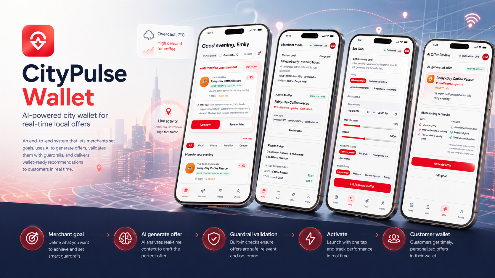
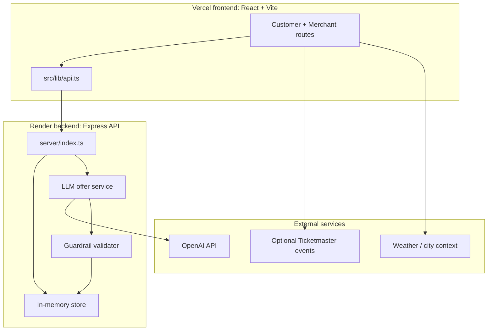
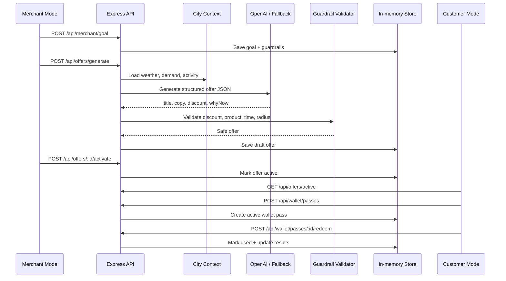

# CityPulse Wallet

Created by **Claire Xue** for the DSV-Gruppe **Generative City-Wallet** hackathon challenge.

**Live Demo:** [https://city-pulse-wallet.vercel.app/](https://city-pulse-wallet.vercel.app/)



CityPulse Wallet is an AI-powered city wallet prototype that connects local city context, merchant goals, and wallet-ready customer offers. The demo shows a full loop: a merchant sets a business goal, an LLM generates a guarded offer, the offer is activated into the customer wallet, the user redeems it, and merchant results update.

## Demo Flow

Start the app at:

```txt
http://localhost:8080/welcome
```

Recommended demo path:

1. Enter **Merchant Mode**.
2. Open **Goal**, choose the business goal and guardrails, then click **Let AI generate offer**.
3. Open **Offer**, review the AI-generated copy, reasoning, and guardrail checks, then activate it.
4. Switch to **Customer Mode**.
5. On Home, click **Use now** to add the AI offer to the wallet.
6. Open **Passes**, redeem the active pass.
7. Return to **Merchant Home** and see redeemed count and revenue update.

## Product Concept

CityPulse Wallet turns city signals into timely local actions. Instead of asking merchants to manually write coupons, the merchant only sets intent and constraints:

- Goal: fill quiet hours, move inventory, or capture nearby demand.
- Guardrails: time window, max discount, radius, products, and brand tone.
- Context: weather, demand signals, nearby activity, distance, and user preferences.

The backend then asks an LLM to generate a structured wallet offer, validates the result with guardrails, and exposes it to the customer app.

## Key Features

### Customer Mode

- Premium mobile wallet home screen with a context-aware hero offer.
- Discover page with category filters and a live map-style offer surface.
- Passes page split into Active, Upcoming, and Used wallet items.
- Two-step wallet behavior: **Use now** adds a pass, **Redeem** consumes it.
- Customer identity: Claire Xue.

### Merchant Mode

- Merchant identity: Chloe’s Café.
- Lightweight merchant control panel with Home, Goal, Offer, and Profile.
- Goal setup with interactive chips, time window, discount, and radius controls.
- AI offer review with generated copy, reasoning, and guardrail checks.
- Results dashboard showing redeemed passes and estimated revenue.

### Backend + AI Flow

- Minimal Express API under `server/`.
- In-memory store for hackathon-speed iteration.
- OpenAI-powered structured offer generation from the backend only.
- Deterministic fallback generation when `OPENAI_API_KEY` is missing or slow.
- Guardrail validator that clamps discount and checks product, time, and radius rules.
- Wallet pass creation, pass redemption, and merchant result updates.

## Tech Stack

- React 18
- TypeScript
- Vite
- Tailwind CSS
- shadcn/ui-style primitives
- React Router
- Sonner toasts
- Lucide icons
- Express
- OpenAI Node SDK
- In-memory backend store

## Getting Started

Install dependencies:

```bash
npm install
```

Create backend environment variables:

```bash
cp .env.example .env
```

Edit `.env`:

```bash
OPENAI_API_KEY=your_openai_api_key
OPENAI_MODEL=gpt-4o-mini
OPENAI_TIMEOUT_MS=8000
PORT=3001
HOST=127.0.0.1
```

`OPENAI_API_KEY` is used only by the backend. Never expose it with a `VITE_` prefix. If the key is missing or the LLM call times out, the backend uses deterministic fallback generation so the demo still works.

Optional frontend event enrichment:

```bash
VITE_TICKETMASTER_API_KEY=your_ticketmaster_api_key
```

Run the backend API:

```bash
npm run server
```

Run the frontend in a second terminal:

```bash
npm run dev
```

Open:

```txt
http://localhost:8080/welcome
```

## Scripts

```bash
npm run dev       # Start Vite frontend
npm run server    # Start Express backend
npm run dev:api   # Start backend with tsx watch
npm run build     # Build frontend
npm run preview   # Preview production build
npm run lint      # Run ESLint
npm run test      # Run Vitest
```

## Useful Routes

```txt
/welcome          App entry screen
/                 Customer home
/discover         Discover offers and map
/passes           Wallet/passbook
/profile          Customer profile
/merchant         Merchant home
/merchant/goal    Merchant goal setup
/merchant/review  AI offer review
/merchant/profile Merchant profile
```

## API Overview

```txt
GET  /api/context/current
GET  /api/merchant/goal
POST /api/merchant/goal
POST /api/offers/generate
GET  /api/offers/latest
POST /api/offers/:offerId/activate
GET  /api/offers/active
POST /api/wallet/passes
GET  /api/wallet/passes?userId=u_001
POST /api/wallet/passes/:passId/redeem
GET  /api/merchant/results
```

The route `POST /api/redeem` is kept as a compatibility alias for adding an offer to the wallet. The actual pass redemption step is `POST /api/wallet/passes/:passId/redeem`.

## Product Flow


## System Architecture



## AI Offer Generation Sequence



## Project Structure

```txt
CityPulse Wallet
├── server/
│   ├── index.ts                         Express API routes
│   ├── store.ts                         In-memory demo data
│   ├── types.ts                         Backend domain types
│   └── services/
│       ├── llmOfferService.ts           OpenAI + fallback generation
│       └── guardrailValidator.ts        Offer safety checks
│
├── src/
│   ├── components/                      Mobile shell, nav, offer cards, map
│   ├── pages/                           Customer and merchant route screens
│   ├── lib/
│   │   ├── api.ts                       Frontend API client
│   │   ├── offerEngine.ts               Local scoring and copy helpers
│   │   └── offerDirectory.ts            Category filtering
│   ├── hooks/                           Weather, local events, offer hooks
│   ├── data/                            Mock user, merchants, and offers
│   └── context/                         Locale and app context
│
├── .env.example                         Backend env template
├── vite.config.ts                       Vite + /api proxy
└── package.json                         Scripts and dependencies
```

## Why This Fits The Challenge

CityPulse Wallet demonstrates a generative city-wallet experience with both sides of the marketplace:

- Residents get offers that feel contextual, wallet-native, and immediately usable.
- Merchants avoid manual coupon creation and instead express goals and guardrails.
- AI generates the offer, but deterministic validation keeps the result safe.
- The demo is fully end-to-end: generation, activation, wallet pass creation, redemption, and merchant results.
